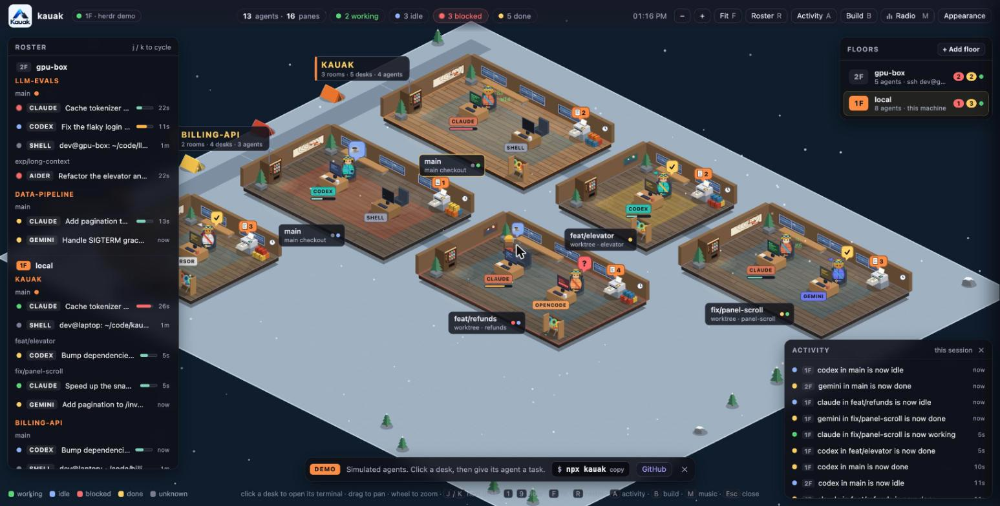

# Kauak


Kauak is a Sims-style isometric office that shows what your coding agents are
doing, live. It connects to [Herdr](https://herdr.dev), a terminal multiplexer
for coding agents, and turns each machine into a floor, each repository into a
wing, each workspace into a room and each pane into a desk, with someone at it
when an agent runs there. You see at a glance who is working, who is on a break
and who is waiting for you, and you click a desk to read that agent's terminal
and answer it.



## Why

With several agents running at once, across repositories and machines, most of
the work is noticing which one needs you. A list of panes does not make that
easy. In Kauak a blocked agent raises its hand and its room pulses red, a
finished one shows a hopping ✓, and an idle one goes for a drink. When one
needs an answer, you give it from the office instead of hunting for the right
tab.

## Quick start

You need Node.js 22 or newer, and Herdr (0.9.x) running on this machine.

```sh
npx kauak serve
```

The office opens at http://127.0.0.1:7788. The package carries the built page,
so there is nothing to clone or build. `npx kauak serve --demo` shows simulated
agents without Herdr, and `npx kauak serve --help` lists the options.

To keep the `kauak` command around, install it globally instead:

```sh
npm install -g kauak
kauak serve
```

> [!NOTE]
> These commands need Kauak's first npm release. If `npm view kauak` finds
> nothing, that has not happened yet: [run it from source](#run-from-source)
> instead.

## Run from source

```sh
git clone https://github.com/agustinrbeltran/kauak.git
cd kauak
pnpm install
pnpm dev
```

`pnpm dev` runs the bridge on port 7788 and the page on http://localhost:5178,
which reloads as you edit. Add `?demo` to the URL for simulated agents.
`pnpm build && pnpm start` runs the built page the way the npm package does.
[CONTRIBUTING.md](CONTRIBUTING.md) has the checks and conventions.

## What you can do

- **Watch**: each agent's state (working, idle, blocked, done) drives its
  animation, the roster and the activity feed. The tab title counts blocked
  agents.
- **Answer**: click a desk to open a mirror of its terminal, and type in the
  message box under it to reply, accept a prompt or run a command. In a Claude
  Code or Codex pane, `/` lists the agent's slash commands.
- **Track context**: Claude Code and Codex agents get a meter showing
  how full their context window is.
- **Read edits as they happen**: each room's printer prints the diff of every
  file edit in its checkout, and shows everything not yet committed.
- **Build**: add desks (new Herdr tabs, with or without an agent) and rooms
  (new git worktrees or folders) from the office.
- **Go remote**: add other machines that run Herdr as floors, over SSH.
  Nothing is installed on them.
- **Make it yours**: pick the Classic office, the Orbital workshop or the
  Alpine basecamp, a background, and a company banner for the wall.

The [guide](docs/guide.md) covers all of it, keyboard shortcuts included.

## Kauak and Herdr

[Herdr](https://herdr.dev) ([source](https://github.com/herdrdev/herdr)) owns
your agents' terminals: the panes and workspaces they run in, on this machine
and others, and it knows what state each agent is in. Kauak runs none of that.
It is a separate project that talks to Herdr through Herdr's
[local socket API](https://herdr.dev/docs/socket-api/): it follows Herdr's
events, reads session snapshots and pane screens, and asks Herdr to send text
and keys, create tabs and worktrees, and start agents when you do those things
in the office. So Kauak needs a running Herdr; without one, only the demo
works. Other machines are reached through an SSH tunnel to their Herdr socket.

Kauak is an independent project. It is not affiliated with or endorsed by
Herdr, and it would not exist without it.

## Architecture

```
Herdr (a unix socket on each machine; through an SSH tunnel for a remote one)
   │  Herdr's API
   ▼
Herdr adapter    packages/bridge/src/machine.js, packages/bridge/src/herdr.js
   │  Kauak terms
   ▼
Bridge server    packages/bridge/src/server.js
   │  the Kauak protocol, over a WebSocket
   ▼
Page             packages/web/
```

- **Herdr adapter** (`packages/bridge/src/machine.js`,
  `packages/bridge/src/herdr.js`): one per floor. It talks to Herdr's socket,
  here or through an SSH tunnel, and translates Herdr's snapshots and errors
  into Kauak's own. Herdr-specific code lives only here.
- **Kauak protocol** (`packages/bridge/src/protocol.d.ts`,
  `packages/bridge/src/protocol.js`): the JSON messages between the page and the
  bridge, described in [docs/protocol.md](docs/protocol.md). The bridge checks
  every message from a page against it.
- **Bridge server** (`packages/bridge/src/server.js`, Node, plain JavaScript):
  serves the page and the WebSocket on 127.0.0.1:7788, and adds what Herdr does
  not report: context usage, read from the agents' transcripts, and file diffs,
  from git.
- **Page** (`packages/web/`, TypeScript, PixiJS, xterm.js, built with Vite):
  lays each snapshot out as floors and rooms, draws the office, and holds the
  roster, activity feed, terminal panel and build mode. For the demo,
  `packages/web/src/demo.ts` speaks the protocol with no bridge at all.
- **CLI** (`packages/kauak/bin/kauak.js`, `packages/kauak/cli/`): the `kauak`
  command, one module per command in `packages/kauak/cli/commands/`.
- **Appearance packages** (`packages/appearance/`): offices and
  characters as declarative JSON, validated before use. See the
  [plugin and banner guide](docs/plugins/README.md).

[How Kauak works](docs/architecture.md) goes into the details.

## Configuration, security and privacy

The bridge can type into your terminals, create worktrees and open SSH
connections, so it listens on 127.0.0.1 only and accepts WebSocket connections
only from pages served by this computer. The environment variables
(`HERDR_SOCKET_PATH`, `KAUAK_PORT`, `KAUAK_HOST`, `KAUAK_ORIGINS`,
`KAUAK_CONFIG`, `KAUAK_SSH`), remote floors and opening the office from another
device are in [docs/configuration.md](docs/configuration.md); the threat model
and how to report a vulnerability are in [SECURITY.md](SECURITY.md).

The page talks only to the bridge, with one exception: the radio. It is off
until you turn it on; then it plays CLIAMP Lofi straight from
[cliamp.stream](https://cliamp.stream), and your browser connects to it
directly.

## Where it's going

Kauak 0.1 is its first version. Next up:

- Publishing to npm, so the quick start above works.
- Sprites in place of the procedurally drawn furniture and people, one piece at
  a time.

Herdr is the only runtime today. The Kauak protocol keeps it behind an adapter,
so that another runtime could be added later. Protocol versioning, incremental
updates and a way for a runtime to say what it supports were left out on
purpose for now; they are possible next steps, not commitments (see
[docs/protocol.md](docs/protocol.md#another-runtime)).

## Contributing

Issues and pull requests are welcome: see [CONTRIBUTING.md](CONTRIBUTING.md).
Report vulnerabilities privately, as [SECURITY.md](SECURITY.md) describes.

## License

[Apache 2.0](LICENSE). The build writes the licenses of the packages bundled
into the page to `dist/THIRD_PARTY_LICENSES.txt`, which ships with the npm
package and the demo.

Artwork: the logo (`packages/web/public/kauak.png`) and banner
(`packages/web/public/kauak-banner.png`) were generated for Kauak with OpenAI's
ChatGPT image generation, and both files carry C2PA metadata saying so. The
contour-map background (`packages/web/src/backgrounds/contours.svg`) appears to
be programmatically generated: evenly spaced concentric rings with no geographic
reference. No map or elevation data is known to have been used.

**Name and logo.** The Apache License 2.0 does not grant permission to use the
Kauak name, logo or banner as trademarks (section 6). Forks and redistributions
are welcome, and so is saying that your project is based on Kauak, but do not
present a modified version as the official Kauak or as endorsed by its
maintainers.
