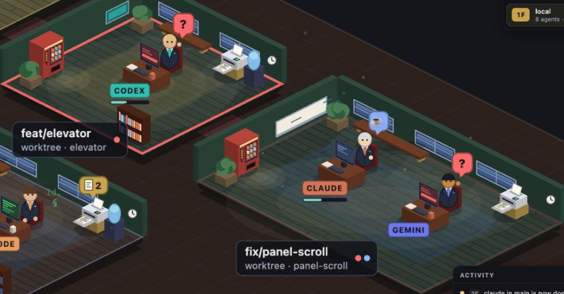

# Appearance packages and company banners

This release adds declarative appearance packages and local company branding.
The original **Classic office** is the default. **Orbital workshop** changes the
architecture, floor treatment, lighting, furniture materials and character
silhouette. **Alpine basecamp** turns rooms into timber huts on the snowline
and dresses agents as climbers. Office and characters can be mixed independently.

## Alpine basecamp

| Office part | Classic | Basecamp |
|---|---|---|
| Floor | checker tiles | `planks`: floorboards with staggered joints |
| Corner plants | potted plants | pines in stone planters |
| Back-corner unit | water cooler or cabinet | stacked expedition duffels |
| Front shelf | bookshelf | gear rack: coiled ropes, helmets, ice axes |
| Lounge | sofa and coffee table | log bench with a wool blanket by a fire pit (the flames flicker) |
| Side wall | whiteboard or poster | topo route map or a peak poster |
| Windows | sky | snowy peaks |
| Campus | plants along the corridor | tents by the trail; pines and boulders in the snow |
| Ambient | dust rising in the light | snow drifting down |

The `climber` character model wears a helmet in `shell` with goggles in
`visor` pushed up on it, a down jacket in the agent's color, a rope over the
shoulder, a harness with a carabiner, a pack and mountaineering boots.
From behind you see the pack, with a coiled rope and an ice axe. Climbers wear
gloves, drink from enamel mugs on a break, and raise a summit flag when their
agent is done. The working glyphs are climbing grades and altitudes.

It goes well with the **Moonlit summit** background.


## Suits

The `suit` character model wears a jacket and trousers in `shell` over a shirt
in `visor`, with a tie and a pocket square in the agent's color. From behind
you see the shirt collar and the jacket's back seam. No included package uses
it; a custom package picks it with `"model": "suit"`.



Appearance changes do not create, close, rename, focus or send input to
terminal sessions. Which terminals the office shows is up to the bridge and
its runtime adapters, never an appearance package. The bridge serves the
packages installed on its machine as files and does not read them.

## Try it

```sh
pnpm install --frozen-lockfile
pnpm web
```

Open `http://localhost:5178/?demo` for simulated agents, or use the normal app
with its existing Herdr bridge. The **Appearance** button opens the settings;
on narrow screens it is a gear with the same accessible name. Pick the office
and characters separately. Choices apply immediately and are saved on this
browser and origin. Escape closes settings and restores focus to its button.
The modal owns keyboard input, so game shortcuts do not act behind it.

Upload your PNG, JPEG or WebP in **Company banner**, then choose **Entrance
sign** or **First room wall**. **Show me** brings the camera to the panel.
The same image appears on each populated floor. Choose a light or dark panel
background to keep your logo readable; the image is contained, not stretched
or cropped, then projected onto the isometric panel. No default company logo is
shown. Use the visibility checkbox, replace the file or **Remove image**.

The banner is saved separately from capability selections. Changing office
keeps the image, visibility and preferred location. When an office lacks that
location, its first anchor is used and settings explain the fallback; the
preferred location is retained for offices that support it. Empty floors wait
for rooms before displaying a panel.

Uploads are capped at 4 MB, 8192 pixels per side and 24 megapixels. Detailed
images are automatically resized further to fit the local storage budget,
preserving their proportions and transparency. A static frame is normalized
to PNG, at most 1600 × 800 within the original aspect
ratio, with a 1.5-million-character data URL limit. SVG is not accepted. No
remote image is fetched or retained. Animated PNG/WebP, if decoded by the
browser, become one static frame; animation is not retained. An unreadable file
leaves the previous banner intact. Storage/quota errors are visible and leave
the previously saved configuration active. Clearing site data removes these
local settings; they do not sync between devices or origins.

The settings are saved under the `kauak.appearance.v1` key.

## Author and load a package

Start from the example: **Download harbor.json** in **More appearances** saves
[harbor.json](../../packages/appearance/examples/harbor.json), the same file
the repository keeps. Change its ID and name and edit its palette. This example
contributes only an office; either included character package can still be
selected. IDs starting with `kauak.` are reserved for included packages; custom
IDs can use lowercase letters, numbers, dots and hyphens, for example
`company.harbor`. A package is 64 KB at most.

There are two places to load it from, and no need for a checkout of the
repository: `npx kauak serve` has both.

**In this browser.** Import the JSON through **More appearances**. It is
validated before saving, appears in the appropriate selectors, survives a
reload and can be removed from settings. An import does not automatically
change the current selection. Up to eight custom packages are kept, on this
browser and origin only. Replace a package by removing it and importing its
new version.

**On the machine that serves the office.** Put the JSON in
`~/.config/kauak/appearances/` (or the folder `KAUAK_APPEARANCES` names), or
start the office with `kauak serve --appearance <file>`, once per file. The
bridge serves every `.json` file there as `/appearances.json`, and the page
loads them with the included packages each time it opens, for every browser
that opens this office. Edit a file and reload the page; remove the file to
uninstall it. Settings list them under **Installed on this machine**, with
each file's path, and a file that is not a valid package is listed with what
is wrong with it while the others load. The bridge does not read what is in
the files: the page validates them as it validates an import, so a file may
not use a reserved ID either. When a file and an import share an ID, the file
wins: the import is not used, and **More appearances** says so beside it so it
can be removed, and a new import with an installed file's ID is refused. The
selection is saved in the
browser as before, so an office chosen from an installed package comes back
on reload as long as the file is there, and falls back to **Classic office**
with a note if it is not. The static demo site has no bridge, so it has no
installed packages.

For a package shipped with the repo, add its JSON to
`packages/appearance/packages/`, then include it in `bundledPackages` in
`packages/web/src/appearance/catalog.ts`. There is no per-package switch in the
scene.

The public API is [contracts.ts](../../packages/appearance/src/contracts.ts).
The runtime boundary is
[registry.ts](../../packages/appearance/src/registry.ts), which has no Pixi,
DOM, bridge, layout or session imports. A manifest has:

```json
{
  "schemaVersion": 1,
  "id": "company.harbor",
  "name": "Harbor office",
  "version": "1.0.0",
  "description": "An office appearance for our team.",
  "capabilities": {
    "office.theme": { "apiVersion": 1, "...": "see the complete example" }
  }
}
```

The fragment above illustrates the envelope; use the complete example for an
importable file. Validation reconstructs accepted fields, requires six-digit
hex colors and bounded numeric values, and rejects unknown fields, capabilities,
API versions, duplicate IDs and resource/code URLs. A missing, removed or
incompatible saved selection resolves to the included default **for that
capability**; valid selections and the banner remain independent. A broken
saved package is skipped with a warning. Bundled defaults are required; a
developer removing or breaking a default is a build/runtime programming error.

| Capability | Host and implemented contract |
|---|---|
| `office.theme` | Browser. Ground, path, walls, wing/focus/rug/light palettes; material colors; wall height; checker/inset/planks floor pattern; botanical/technical/alpine décor and lighting intensity; 1–4 banner anchors. |
| `office.characters` | Browser. Human/robot/climber/suit silhouette templates; skin/hair/shell/visor colors (a robot's body and visor, a climber's helmet and goggles, a suit's jacket and shirt); animation tempo for each of the five states; motion amplitude and working glyphs. Semantic status colors and agent-kind labels stay in the core. |

The scene consumes only validated capability data. The core still owns
snapshot interpretation, room/desk layout, session identity, camera, selection,
state meanings, hit testing and depth ordering. Switching appearance rebuilds
render nodes using the same snapshot/pane references and retained animation
states. Old render nodes are destroyed; an unchanged banner texture is reused.
Reduced-motion system preferences stop ambient/character movement and make
camera/floor transitions immediate.

Furniture has a coherent first extension path through theme **materials** and
**décor** presets. This version does not provide free furniture placement,
custom sprite resources or arbitrary renderer templates. New silhouettes or
primitive templates require a deliberate public API extension, not a package
that reaches into private scene internals.

## Banner anchor contract

Each theme must supply at least one uniquely identified anchor:

```json
{
  "id": "entrance",
  "name": "Entrance sign",
  "origin": "campus",
  "x": 0.2, "y": -2.4, "z": 14,
  "width": 5.8, "height": 58,
  "facing": "x"
}
```

`origin` is `campus` (floor-plan origin) or `first-room` (relative to the first
room of the displayed floor). Coordinates and width use floor tiles; `z` is
the panel's bottom height and `height` is pixels in the wall plane. `facing`
is `x` or `y`, selecting the isometric wall axis. Width is 1–7 tiles, height
20–64 pixels, x/y offsets −3–8 and z 0–40. Themes own these anchor definitions;
the user's image and preferred anchor ID remain outside the package. Choose
locations that avoid desks. The included entrance is a supported sign on the
campus; the room anchor mounts the panel above its back wall.

## Adding a future capability

Use this envelope and capability registry: appearance packages are data, not
code. Add a versioned data contract and its entry in `CAPABILITIES` to
`contracts.ts`, and a validator to `registry.ts`. Supply a known default and an
explicit host implementation, then bind that host to resolved data. Keep
configuration in its own capability selection.

A new runtime is not an appearance package: it is a `Runtime` adapter in the
bridge, under `packages/bridge/src/runtimes/`. The bridge never reads
appearance packages.

Unknown capabilities currently fail validation. Panels, actions, service
management, downloaded JavaScript, dependency resolution and a marketplace are
outside this release.

## Validation and review evidence

```sh
pnpm test:appearance
pnpm typecheck
pnpm build
pnpm build:demo
git diff --check
```

Contract tests cover import incompatibility, bounds, duplicate/reserved IDs,
code/URL rejection, registry fallback, separate persisted capabilities and
banners, corrupted storage and quota errors. They compile the public API in a
temporary directory and do not use a browser or the bridge.

Browser checks on **5 October 2026** used a separate Chrome context and the
demo, with a neutral **Company banner test** image. The tool could not access
this worktree through its native file-chooser helper; the fixture was generated
inside the page and passed as a real `File` through the same file-input change,
decoding, normalization, persistence and rendering path. No real company logo
was invented or used. [test-banner.png](test-banner.png) is the matching fixture.

Observed checks:

- Both included packages render distinctly, including a mixed office/character selection.
- A separate scene fixture with all five states preserved the original snapshot,
  the exact pane object references and IDs, selected `blocked` pane, camera
  `(321, 123, 0.8)` and animation phases through appearance changes.
- A change in the demo immediately preserved all 16 roster identities/states.
- Banner upload/containment, location change, hide/show, theme change keeping
  identical image data, reload restoration, removal surviving reload and re-upload.
- An invalid image retained the previous banner and explained how to recover.
- Light/dark panel selection survived reload; a file over 4 MB was rejected
  without replacing the previous image.
- Custom Harbor import/selection/removal and Classic fallback; an incompatible
  API import showed a clear error while retaining the current office.
- Escape closed the modal and restored button focus. Settings fit at desktop
  1440 × 780 and emulated mobile 390 × 844 / 320 × 740; the gear stays visible.
- No browser console errors or warnings in these checks.

An additional check in the in-app browser used a detailed 2172 × 724 PNG
under the 4 MB upload limit. The original normalization exceeded the storage
budget and was rejected. Automatic resizing now saves it as a 1311 × 437 PNG
within the budget, displays it on the entrance sign and restores it after
reload. The user's image and screenshot are not included in this repository.

Screenshots: [Classic](classic.jpg), [Orbital](orbital.jpg), [Basecamp](basecamp.jpg),
[settings](settings.jpg), [mobile](mobile.jpg). These show evolving simulated
agents, not a synchronized benchmark of real sessions.

Final checks: **7/7 contract tests**, typecheck, normal build, demo build and
diff whitespace checks passed.
Vite still emits its existing warning about chunks larger than 500 KB.
